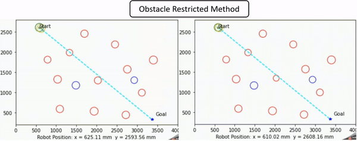
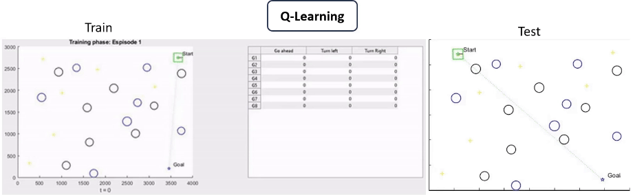
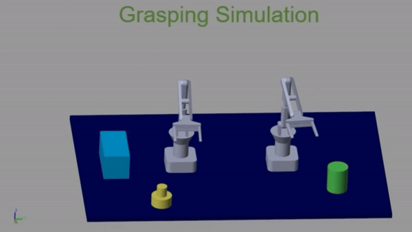

# Obstacle Avoiding & Grasping Robot

## Overview
- This is a small project suitable for students who are studying majors such as mechatronics, electronics, automation, information technology, ... or research on mobile robots at university.
- Dependency: Code Composer Studio, Matlab, Arduino IDE, Python, Autocad, Solidworkds, Altium.

## Demo

## Implementation
1. Embedded Software:
    - Tiva C TM4C123GH6PZ microcontroller acts as a master. This microcontroller is used to read the feedback signal from TCRT5000 sensors to identify the position of the mobile robot, then calculate the speed and send velocity to two slaves microcontrollers (Arduino).
    - Two Arduino Nano microcontrollers act as slaves. These two microcontrollers receive the set speed value from the master and implement PID algorithm to control wheel speed.
    - RC Servo MG995, RC Servo MG90s, DC GM25 370 & Encoder.
2. Algorithm: python & matlab code for methods.
3. Drawings: folder containing selection drawing, mechanical design drawings, control algorithm design drawings and wiring diagrams of the mobile robot.
4. Demo: folder containing experimental results.
5. Electrical: Altium design.
6. Mechanical: Solidworks design.
7. SampleAndCalib: sampling and calibration.

## Acknowledgement

Thanks to team member (Doan Minh Khoi - [Email](1611648@hcmut.edu.com)) who contributed to this while still university student.

## Maintainers
* Tran Dang Trung Duc
